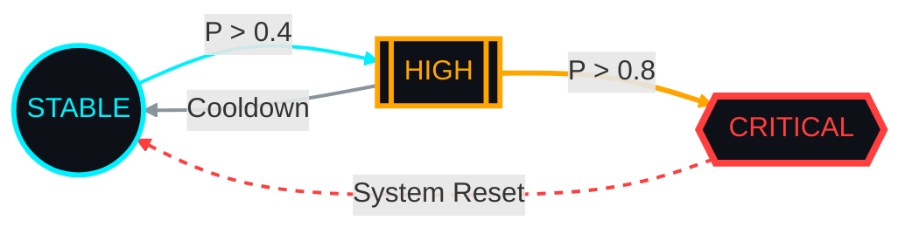

<p align="center">
  
</p>

<h1 align="center">🚨 NEURAL GATE v3.1</h1>
<h3 align="center">Crowd Intelligence • Autonomous Threat Detection • Real-Time Behavioral Analytics</h3>

---

<p align="center">
  
  
  
  
</p>

<p align="center">
  
  
  
</p>

<div align="center">

### ⚡ Next-Generation AI Surveillance Engine  
*From Detection to Behavioral Intelligence*

</div>

---

## 🎬 Live Demo

Demo preview coming soon.

Run locally:

http://localhost:5000


---

# 🧠 Executive Overview

**Neural Gate v3.1** is a real-time behavioral surveillance intelligence engine designed to detect, quantify, and anticipate abnormal crowd dynamics using multi-object tracking and mathematical risk modeling.

Unlike traditional CCTV analytics that stop at detection, Neural Gate:

- Interprets collective motion vectors  
- Computes behavioral entropy  
- Models escalation patterns  
- Triggers autonomous evidence capture  

It does not just detect objects.  
It analyzes *emergent behavior*.

---

## 🏗 System Architecture

<p align="center">
  
</p>

---

# ⚙ Core Intelligence Modules

## 1️⃣ Multi-Object Vector Engine

- Bounding box tracking
- Frame-to-frame displacement vectors
- Acceleration modeling
- Crowd centroid dynamics
- Real-time state propagation

---

## 2️⃣ Behavioral Calculus Engine

| Metric | Intelligence Function |
|--------|----------------------|
| Velocity (v) | Mean displacement over Δt |
| Acceleration (a) | Rate of vector change |
| Density (ρ) | Spatial clustering intensity |
| Coherence (C) | Directional alignment |
| Panic Index (P) | Composite instability metric |

---

# 📐 Mathematical Threat Modeling

Panic Index formulation:

$$P = \sum (a_{i} \cdot \rho_{i}) + S$$

**Where:**
* **$a_{i}$** = acceleration vectors
* **$\rho_{i}$** = local density weight
* **$S$** = spatial entropy (chaotic dispersion)  

This enables detection of emergent instability rather than isolated anomalies.

---

# 🚨 Deterministic Threat Escalation
### 🛡️ Threat Management Protocol
The system transitions between operational states based on the calculated **Panic Index ($P$)**:
<p align="center">


</p>

### 📋 State-Action Logic Matrix
| Current State | Threshold ($P$) | System Action | Dash Indicator | DVR Status |
| :--- | :--- | :--- | :--- | :--- |
| *STABLE* | $P < 0.4$ | Standard Monitoring | 🟢 Solid Green | IDLE |
| *HIGH* | $0.4 \leq P < 0.8$ | Analytics Warning | 🟠 Pulsing Orange | *ARMED* |
| *CRITICAL* | $P \geq 0.8$ | Autonomous Response | 🔴 Flashing Red | *RECORDING* |

##### 🎥 Autonomous Incident Capture
When:
```text
Threat ≥ 75%
```
The system automatically:

- Initiates DVR recording
- Saves timestamped evidence
- Logs event metadata
- Activates visual alert overlays

No operator intervention required.

---

# 🧩 Smart Input Engine

## Local Mode
- Binds automatically to `/dev/video0`
- Direct webcam feed
- Ultra-low latency

## Docker Mode
- MP4 simulation stream
- Hardware-independent
- Fully portable deployment

---

# 🖥 Dashboard Interface

- Glassmorphic panels  
- Neon threat indicators  
- Real-time velocity graph  
- Live “LIVE” pulse signal  
- Auto-record alert banner  
- High-contrast cyber UI  

Designed for command-center deployment.

---

# 📦 Project Structure
```text
Neural-Gate-v3.1/
│
├── app.py # Flask-SocketIO Core Server
├── engine.py # YOLOv8 Inference & Tracking
├── metrics.py # Behavioral Calculus Engine
├── config.py # Thresholds & Hyperparameters
│
├── static/
│ ├── recordings/ # Captured incident footage
│ └── assets/
│
├── templates/
│ └── dashboard.html # Frontend Interface
│
├── Dockerfile
├── requirements.txt
└── README.md
```

---

# 🚀 Deployment

## 🔹 Local (Webcam Mode)
```bash
git clone https://github.com/ahmedxzarai/Neural-Gate-v3.1
cd Neural-Gate-v3.1

python -m venv venv
source venv/bin/activate
# Windows: .\venv\Scripts\activate

pip install -r requirements.txt
python app.py
```
Live at: http://localhost:5000

## 🔹 Docker (Simulation Mode)
```bash
docker build -t neural-gate:3.1 .
docker run -p 5000:5000 neural-gate:3.1
```
Live at: http://localhost:5000

# 📊 Performance Profile

- Real-time YOLOv8 inference
- Sub-100ms metric update latency
- Deterministic state transitions
- Containerized production architecture
- Hardware-agnostic execution

# 🔐 Strategic Applications

- Smart city monitoring
- Stadium & event analytics
- Airport crowd safety
- Industrial perimeter intelligence
- Behavioral anomaly research

# 🧪 Roadmap

- Multi-camera distributed inference
- Edge deployment optimization (Jetson)
- Cloud aggregation layer
- Reinforcement-based adaptive thresholds
- Privacy-preserving anonymization module

---

### 👤 Author
**AHMED ZARAI**<br>
*AI Systems & Biometric Intelligence Developer*<br>
⚡Powered by Neural Gate v3.1 — Anticipating threats through crowd intelligence.
<br><br><br>

<div align="center">
<p>Copyright © 2026 AHMED ZARAI. Distributed under the MIT License.</p>
</div>